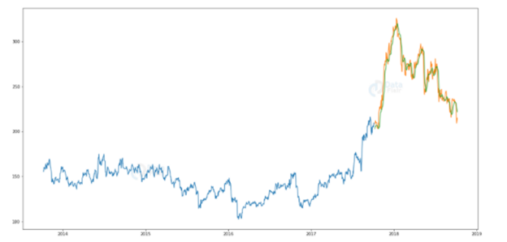

We will build on our Project 2 to add historical price data and predict future crop area, production, and prices. 
# Data
* Crop State and National Data:
* Crop Area
* Crop Production
* Crop Yield
* Price Data:
* CME daily price for corn, soybean, wheat, cotton, live cattle
# Analysis
* Use machine learning to forecast crop prices
* Predict future crop area and yield
* https://data-flair.training/blogs/stock-price-prediction-machine-learning-project-in-python/

# Visualization
* Add a chart with drop down menu to display our price forecast with the ability to toggle through various commodities.

 

